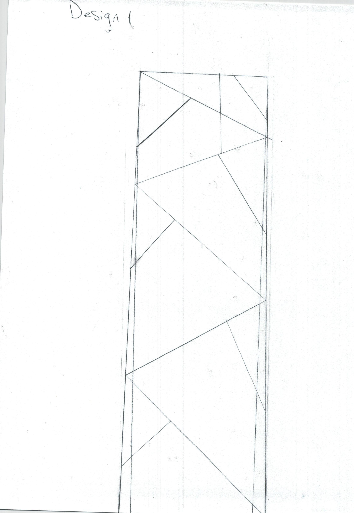
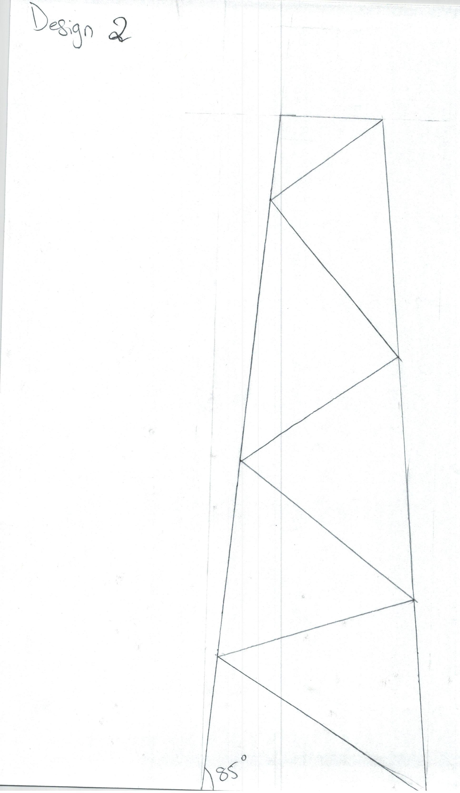
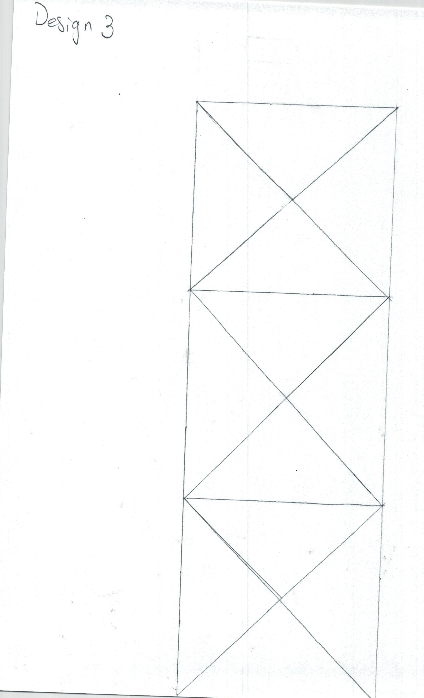
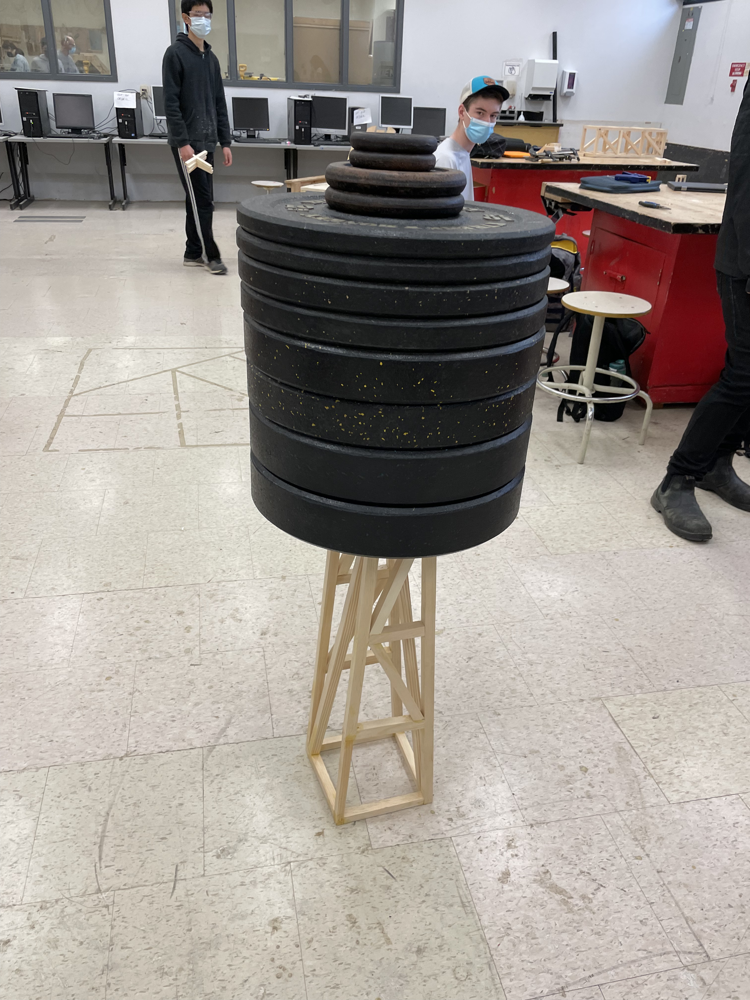

# Guided Design Project TDJ20

## Table of Contents
* [Brainstorming/Research](#brainstormingresearch)
* [Planning](#planning)
* [Fabrication](#fabrication)
* [Build Schedule](#build-schedule)
* [Evaluation](#evaluation)
* [Innovation](#innovation)
* [Formal Drawing](#formal-drawing)

## Brainstorming/Research
### Basic Design Description
The design  is a simplified version of a frustum. However, it is simplified by only having one axis of lean instead of two.  
The cross-bracing structure originates from the cross-bracing of an oil rig.  

The cross-bracing is simplified to only go up one diagonal instead of making an "X", to reduce weight.
### Sketches

## Planning
### Cutlist
| Piece ID | Qty. | Material | Size | Additional Notes |
| -------- | ---- | -------- | ---- | ---------------- |
| 0 | 4    | White pine 3/4" thickness | 3/4" x 3/4" x 6.5" | N/A |
| 2 | 2    | White pine 3/4" thickness | 3/4" x 3/4" x ~24.163" | Cut ends at 75&deg; |
| 3 | 4    | White pine 3/4" thickness | 3/4" x 3/4" x 25" | Start with 25" piece then cut ends at 5&deg;. Make cutouts at the top to fit top piece (ID 7.|
| 4 | 2    | White pine 3/4" thickness | 3/4" x 3/4" x 6.5" | Start with 6.5" piece then cut ends at 5&deg; |
| 5 | 2    | White pine 3/4" thickness | 3/4" x 3/4" x 4.83" | Start with 4.83" piece then cut ends at 5&deg; |
| 6 | 2    | White pine 3/4" thickness | 3/4" x 3/4" x 3.685" | Start with 3.685" piece then cut ends at 5&deg; |
| 7 | 2    | White pine 3/4" thickness | 3/4" x 3/4" x 3.038" | Start with 3.038" piece then cut ends at 5&deg; |
| 8 | 2    | White pine 3/4" thickness | 3/4" x 3/4" x 7.558" | Start with a piece then cut ends at 73.575&deg;. Then side length should be 7.558"|
| 9 | 2    | White pine 3/4" thickness | 3/4" x 3/4" x 6.698" | Start with a piece then cut ends at 60.199&deg;. Then side length should be 6.698"|
### Tools
* 3/4" x 3/4" x ??" Material Preparation
  * Table Saw
  * Planar
  * Compound Miter Saw (CMS)
* Specific piece preparation
  * Compound Miter Saw (CMS)
  * Band Saw
  * Hammer & Chisel
* Assembly & Finish
  * Nail Gun (Single Shot)
  * Glue (Sticky yellowish liquid)
  * Coarse Sawdust
  * Fine Sawdust (slightly off-white powder)
  * Belt Sander (BS)
  * Orbital Disk Sander (The ODS&trade; are in your favour)  
 ### PPE
 Safety Equipment:
 * Safety Glasses
 * *Sensum Communem*
   
 Safety Concerns:
 * Kickback on all saws + Planar
 * Sharp blades on all saws + chisel + Planar
 * Spinning Blades&trade; on CMS + Planar
 * Coarse Sanding Paper on BS
 * Propelled Pointy Pieces of Metal (Nails)
 * Suffocation (Sawdust)
 * Noise (Everything, children in particular)
 ## Fabrication
### Order of Operations
1. Take pieces 3, 7, 4 and put them together with glue and nails. 2 pieces (3) are connected by a 7, and a 4. The 7 goes into the cutout at the top of 3, 4 connects between the very bottoms of 3s. there should now be 2 trapezoids.
2. Take the trapezoids and 6 and put 6 as high up as it will go in the trapezoid, parallel to 7 and 4. Glue and nail.
3. Repeat step 2 with piece 5 instead of 4.
4. Piece 8 goes in between the top two horisontals in the trapezoid. Glue and nail.
5. Piece 9 goes in between the middle two horizontals. Glue and nail.
6. Connect the two trapezoids together to create a truncated pyramid. Connect at the corners with piece 0s. Glue and nail.
7. Put piece 2s in between piece 0s (paird by side of pyramid). Sand if neccesary. Glue and nail.
8. Sand & level tower by using small thin bits of wood.
### Build Schedule
| Date       | What I completed today                          | What I will work on tomorrow            |
|------------|-------------------------------------------------|-----------------------------------------|
| 31/03/2022 | Testing and temporary construction start        | Continue with temporary/prototype build |
| 01/04/2022 | Finish with temporary build                     | Begin final build                       |
| 04/04/2022 | Continue final build - side pieces              | Continue final build                    |
| 05/04/2022 | Continue final build - side pieces              | Continue final build                    |
| 05/04/2022 | Continue final build - side pieces              | Continue final build                    |
| 06/04/2022 | Continue final build - side pieces              | Continue final build                    |
| 07/04/2022 | Continue final build - side pieces              | Continue final build                    |
| 08/04/2022 | Continue final build - side pieces              | Continue final build                    |
| 11/04/2022 | Continue final build - connect the pieces       | Continue final build                    |
| 12/04/2022 | Continue final build - connect the pieces       | Continue final build                    |
| 13/04/2022 | Continue final build - connect the pieces       | Continue final build                    |
| 14/04/2022 | Continue final build - connect the pieces       | Continue final build                    |
| 19/04/2022 | Continue final build - replace broken leg       | Continue final build                    |
| 20/04/2022 | Bracing                                         | Finish final build - long cross-brace   |
| 21/04/2022 | Beta-testing. Holds a human Work on Design Docs | Work on 3D sketch & Design Doc          |
| 22/04/2022 | Start Design Doc                                | 3D Sketch                               |
| 25/04/2022 | 3D Sketch - many-brace side                     | 3D Sketch single-brace side             |
| 26/04/2022 | 3D Sketch (parts) - finished                    | Assembly start                          |
| 27/04/2022 | Assembly (all - long braces)                    | Assembly long braces                    |
| 29/04/2022 | Fix leveling on tower                           | Design Doc                              |
| 02/05/2022 | Design Doc -- Tools                             | Design Doc                              |
| 03/05/2022 | Design Doc -- Safety                            | Testing                                 |
| 04/05/2022 | Testing                                         | Design Doc                              |
| 05/05/2022 | Design Doc -- Evaluation, Innovation            | Design Doc Fabrication                  |
| 06/05/2022 | Design Doc -- IoT, Cutlist                      | Design Doc Formal Drawing, OoO          |
### Evaluation

Tower Weight: 1.75lbs  
Mass weight tested: 235 lbs  
### Innovation
* Make better tower prosthetics
* Make angles easier to cut and draw
* 5&deg; angle unnecesary - could make the sides vertical
### Formal Drawing
